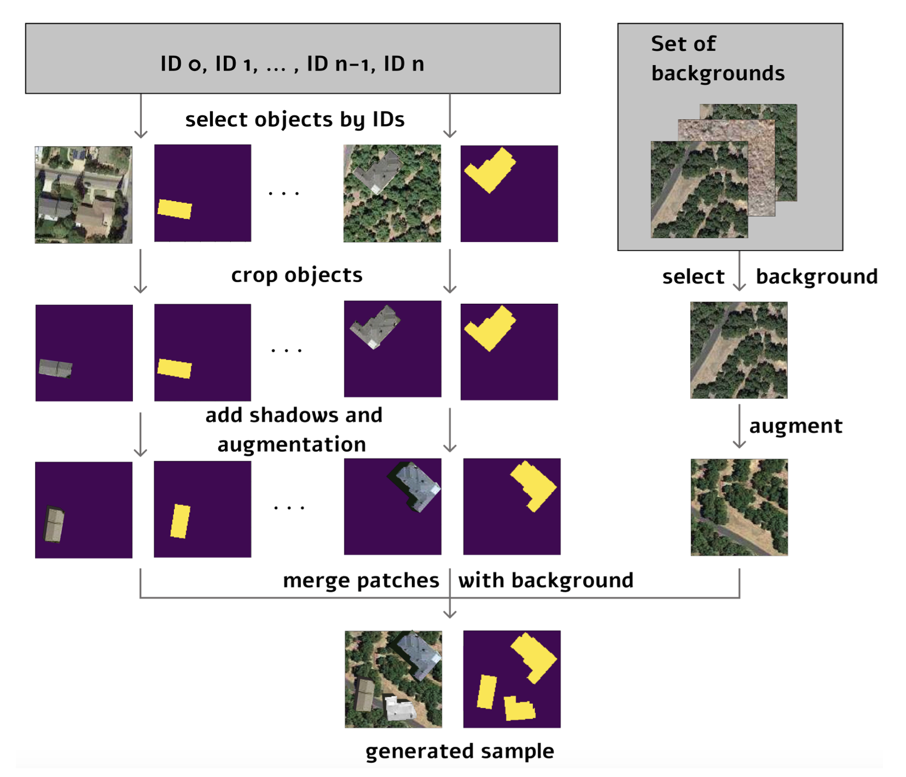

# Object-Based Augmentation (OBA)

## Overview
**Object-Based Augmentation (OBA)** is a data augmentation technique that generate new training samples by pasting objects onto different backgrounds. The method was presented in the paper ["Object-Based Augmentation Improves Quality of Remote Sensing Semantic Segmentation"](https://arxiv.org/pdf/2105.05516) (Illarionova et al., 2022). This folder contains the code, installation and setup guide necessary for training a model with object-based augmentation. Code is inspired by the following code: [](https://github.com/LanaLana/satellite_object_augmentation).



---

## Method


When training a model for semantic segmentation on remote sensing data, having a large dataset usually leads to better accuracy. However, in many cases, the amount of available annotated data is limited. To deal with this, object-based augmentation can be used to generate more training examples. This method works by using the segmentation masks to extract specific objects (areas showing deforestation) and then pasting them onto new backgrounds. Instead of just applying basic transformations like flipping or rotating, object-based augmentation creates entirely datapoints by changing where and how objects appear. This helps the model learn a wider range of spatial arrangements and environmental variations. By building more diverse and realistic samples, the model gets better at generalizing to new, unseen data.


## Installation and Setup

1. **Clone repository**

```bash
git clone https://github.com/INF367A-Solafune.git
```

2. **Install global requirements**

```bash
pip install -r requirements.txt
```

3. **Choose dataset type**

Before runnin the code, choose `dataset = "OBA"` in `main.py`. Move to repository folder and run 

```bash
python main.py
```
or 

```bash
python3 main.py
```

## Usage

Depending on your hardware limitations and training setup, you can choose whether to save generated samples:

* **To save generated samples to disk** (recommended for limited RAM situations):

```python
dataset = create_save_OBA_images(...)
```

* **To generate samples without saving:**
```python
dataset = create_OBA_tensor_dataset(...)
```

In our experiments, following the original Object-Based Augmentation paper, samples were initially generated without saving to minimize memory usage and maintain maximum randomness.
However, we encountered RAM limitations during training — generating samples on-the-fly caused the system to crash.
To overcome this, we decided to save the generated images and masks before training. This approach allowed us to train models successfully, even though it slightly reduced randomness between runs.

Even when using saved samples, new samples are generated and saved anew at each training run, ensuring a degree of randomness between runs. 

The code in this folder is used for image augmentation to generate new data points.

## OBA Parameters
Both `create_save_OBA_images` and `create_OBA_tensor_dataset` support the following configurable parameters:


| Parameter | Type | Default | Description |
|:---|:---|:---|:---|
| `prob_of_OBA` | `float` | 0.5 | Probability of generating an OBA sample. |
| `subset` | `bool` | False | Whether to use a subset of the dataset. |
| `augm` | `bool` | True | Apply standard augmentations. |
| `object_augm` | `bool` | True | Apply object-based augmentations. |
| `extra_background_prob` | `float` | 0.0 | Probability of using an additional background. |
| `background_augm_prob` | `float` | 0.6 | Probability of applying background augmentations. |
| `shadows` | `bool` | False | Whether to add shadows to objects. |
| `extra_objects` | `int` | 3 | Number of extra objects to add per sample. |
| `object_augm_prob` | `float` | 0.0 | Probability of augmenting objects. |
| `augm_prob` | `float` | 0.8 | Probability of applying any augmentation. |
| `geometric_augm_prob` | `float` | 0.6 | Probability of applying geometric transformations. |
| `color_augm_prob` | `float` | 0.6 | Probability of applying color augmentations. |
| `batch_size` | `int` | 10 | Batch size for the dataset. |
| `min_area` | `int` | 1000 | Minimum object area (in pixels) to be considered valid. |
| `use_SR` | `bool` | False | Whether to use super-resolution images. |


## Citation

```
@misc{illarionova2022objectbasedaugmentationimprovesquality,
      title={Object-Based Augmentation Improves Quality of Remote Sensing Semantic Segmentation}, 
      author={Svetlana Illarionova and Sergey Nesteruk and Dmitrii Shadrin and Vladimir Ignatiev and Mariia Pukalchik and Ivan Oseledets},
      year={2022},
      eprint={2105.05516},
      archivePrefix={arXiv},
      primaryClass={cs.CV},
      url={https://arxiv.org/abs/2105.05516}, 
}
```
