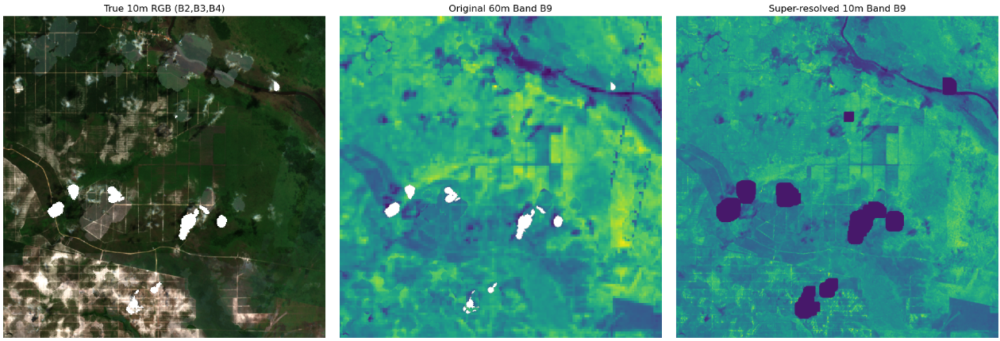

# Super-Resolution: DSen2 - Implemented for GeoTIFF using pretrained weights(superresolution.py)

Author
----------

Christian Bontveit

## Overview

DSen2 is a super-resolution network introduced in the paper "Super-resolution of Sentinel-2 images: Learning a globally applicable deep neural network".
It works by training two neural networks: one for super-resolving 20m bands and another for 60m bands.

Sentinel-2A satellite imagery contains 12 spectral bands, acquired at three different ground sampling distances (GSDs): 10m, 20m, and 60m. The higher the GSD, has lower resolution (more blur and less detail).
To improve the quality of the lower-resolution bands, we can use a super-resolution model like DSen2.

While simple interpolation methods exist, DSen2 introduced a novel approach at the time: using the available high-resolution bands for each image as information to guide the super-resolution of the lower-resolution bands.

The original authors published their code in Keras, but it was designed for .SAFE Sentinel-2A products, which include extensive metadata and hierarchical folder structures that are not present in our GeoTIFF data.

The Remote-Sensing-Processor (RSP) also reimplemented DSen2 in PyTorch, but this version still expects .SAFE products.
This project adapts the pretrained weights from RSP and implements a version of DSen2 that works directly with GeoTIFF files.

## Method superresolution.py

This project adapts the pretrained DSen2 model to super-resolve GeoTIFF images without relying on the .SAFE structure.

    The superresolution.py script loads pretrained weights for both 20m and 60m models.

    GeoTIFF files are read, and the bands are separated based on their original GSDs.

    Bands at 20m and 60m resolution are super-resolved using the respective models.

    Super-resolved bands are combined with native 10m bands to produce a full GeoTIFF file.

    Outputs are saved according to the paths specified in the .env configuration file.

    The super-resolution step can be run standalone (superresolution.py) or used in the train pipeline (main.py using for dataset in ["SR"]).

### Results superresolving 60m GSD band B9



Plot of 6x superresolution results train 0.tif.  
Leftmost 10m GSD RGB (B2, B3, B4), middle 20m GSD B9, rightmost superresolved band B9.

## Installation and Setup

1. **Install global requirements**

    Ensure dependencies is installed by the global requirements.txt

2. **Download the pretrained weights from (https://doi.org/10.5281/zenodo.11091321)**

    location of weights in repository:
    src/
        remote_sensing_processor/
            sentinel2/
                superres/
                    weights/
                        L2A20M.pt
                        L2A60M.pt

    Location of the weights is not important as long as you follow the next step correctly

3. **Add the required paths in .env**

    In the superresolution.py do i refer to these paths to get weights
    and save location for the superresolved images

    ```
    IMAGES_PATH=path/to/images
    SR_IMAGES_PATH = path/to/superresolved_images
    SR_20M_PATH = path/to/superresolution_20m_model
    SR_60M_PATH = path/to/superresolution_60m_model
    ```

4. **Details for running**

    - You can generate the superresolved images by running superresolution.py,
    running from here you can continue even after interupt.
    - They will also be generated if you run main.py using mode "SR",
    if you have the whole dataset 176 images it will not need to rerun superresolution.py
    but if you have an empty or uncomplete superresolved_images folder it will not run properly

## Usage

This implementation is designed for standalone GeoTIFF Sentinel-2A images in a folder (IMAGES_PATH).
It superresolves all images in the specified folder using the pretrained DSen2 weights
and saves the outputs according to the .env settings (SR_IMAGES_PATH.)

## Citation

```
@article{LANARAS2018305,
title = {Super-resolution of Sentinel-2 images: Learning a globally applicable deep neural network},
journal = {ISPRS Journal of Photogrammetry and Remote Sensing},
volume = {146},
pages = {305-319},
year = {2018},
issn = {0924-2716},
doi = {https://doi.org/10.1016/j.isprsjprs.2018.09.018},
url = {https://www.sciencedirect.com/science/article/pii/S0924271618302636},
author = {Charis Lanaras and José Bioucas-Dias and Silvano Galliani and Emmanuel Baltsavias and Konrad Schindler},
}
```

> github DSen2 (orginal implementation). https://github.com/lanha/DSen2
>
> doi.org RemoteSensingProcessor (weights). https://doi.org/10.5281/zenodo.11091321