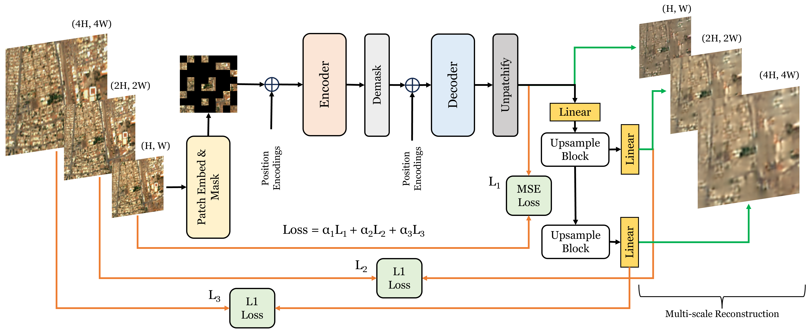

# SatMAE++ Individual Implementation

Author
----------

Aurora Ingebrigtsen

## Overview

The SatMAE++ framework was introduced in ["Rethinking Transformers Pre-training for Multi-Spectral Satellite Imagery"](https://arxiv.org/abs/2403.05419) (Noman et al., 2024). This folder contains the code, installation and setup guide necessary for running the finetuning part of the framework on the Solafune deforestation drivers competition. I use the pretrained model with weights provided by the authors on GitHub at [techmn/satmae_pp.](https://github.com/techmn/satmae_pp).

## Method
Satellite imagery often has high variability in both spatial and spectral dimensions. For example, Sentinel-2 imagery with 12 bands span visible, near-infrared, and shortwave infrared wavelengths, with each band’s central wavelength capturing different portions of the spectrum. The real world area represented by each pixel, referred to as Ground Sample Distance (GSD), also varies between bands, ranging from 10 m to 60 m.

Most self-supervised pre-training methods either ignore these scale differences or focus on a single modality (e.g., RGB). This limits their ability to generalize across diverse satellite datasets. SatMAE++ addresses this gap by modeling multi-scale information during masked reconstruction. It builds an image at different scale level resolutions, reconstructing each level. The SatMAE++ framework demonstrates state-of-the-art performance on downstream remote-sensing tasks. The image below contains a representation of the full pretraining architecture.





The paper demonstrates the abilities of the framework using a vision transformer backbone for pretraining on the fMoW dataset. fMoW is a huge dataset consisting of sentinel-2 imagery. The paper presents state of the art results on several downstream tasks, and thus suggest that the model pretraining has made the model learn spectral-spatial features. These learned features can be helpful for other tasks as well, such as our deforestation task. Thus, this folder contains the code necessary to apply finetuning on our deforestation dataset.  

For the finetuning a segmentation head was added to
the ViT-large model, and a given number of layers
was trained.

## Installation and Setup

1. **Install global requirements**

    Ensure dependencies is installed by the global requirements.txt

2. **Download the ViT-Large [pretrained weights](https://huggingface.co/mubashir04/checkpoint_ViT-L_pretrain_fmow_sentinel) from hugging face**
    The weights should be placed inside the satmae_pp folder.
    ```bash
    wget -O checkpoint_ViT-L_pretrain_fmow_sentinel.pth \
    https://huggingface.co/mubashir04/checkpoint_ViT-L_pretrain_fmow_sentinel/resolve/main/pytorch_model.bin
    ```

## Usage
To reproduce the finetuning run the main file. 


## Citation
The functions in **satmae_pp.py** (expect load_freeze_layers) is retrieved from https://github.com/techmn/satmae_pp
```
@inproceedings{satmaepp2024rethinking,
      title={Rethinking Transformers Pre-training for Multi-Spectral Satellite Imagery}, 
      author={Mubashir Noman and Muzammal Naseer and Hisham Cholakkal and Rao Muhammad Anwar and Salman Khan and Fahad Shahbaz Khan},
      year={2024},
      booktitle={CVPR}
}
```

> techmn. _satmae_pp_. GitHub. 2025. https://github.com/techmn/satmae_pp
